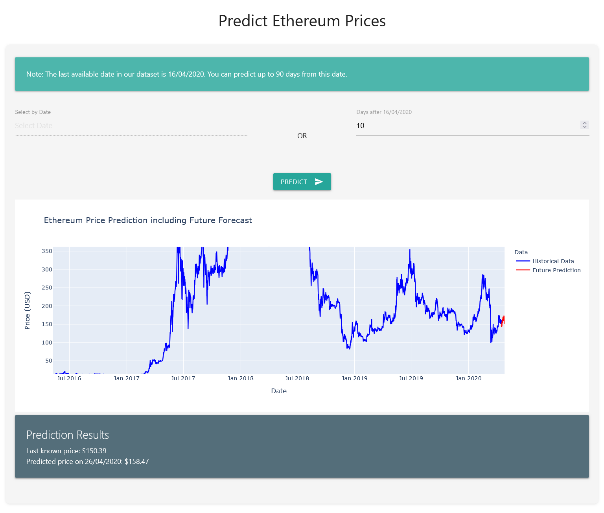

# Ethereum Price Prediction

This project provides a Flask-based web application for predicting Ethereum prices using machine learning. Users can input a future date or specify a number of days from the last known date to get a price prediction.



## Getting Started

There are two ways to use this project: training the model yourself using the provided Jupyter notebook, or using the pre-trained model via Docker.

### Option 1: Training the Model

1. Clone this repository:
   ```
   git clone https://github.com/pourya/eethereum-predictio.git
   cd ethereum-price-prediction
   ```

2. Download the dataset:
   - Visit [Ethereum Historical Dataset on Kaggle](https://www.kaggle.com/datasets/prasoonkottarathil/ethereum-historical-dataset)
   - Download the `ETH_1H.csv` file

3. Open and run the `Ethereum Price Prediction.ipynb` notebook:
   - This notebook contains the code to train the model
   - Follow the instructions within the notebook to train and save the model

4. After training, ensure the following files are in your project directory:
   - `ethereum_price_model_full.keras`
   - `scaler_full.h5`

5. Install the required Python packages:
   ```
   pip install -r requirements.txt
   ```

6. Run the Flask application:
   ```
   python app.py
   ```

7. Open a web browser and navigate to `http://localhost:8080`

### Option 2: Using Docker

If you prefer to use the pre-trained model without going through the training process, you can use the Docker image:

1. Pull the Docker image:
   ```
   docker pull pouryare/ethereum-prediction-app:latest
   ```

2. Run the Docker container:
   ```
   docker run -p 8080:8080 pouryare/ethereum-prediction-app:latest
   ```

3. Open a web browser and navigate to `http://localhost:8080`

## Usage

Once the application is running:

1. You'll see two input options:
   - Select a specific date
   - Enter the number of days from the last known date (16/04/2020)
2. Choose one of the input methods and click "Predict"
3. The application will display a chart showing historical data and the predicted price, along with the predicted price value

## Project Structure

- `app.py`: Main Flask application
- `model.py`: Contains the prediction model and related functions
- `requirements.txt`: List of Python dependencies
- `Dockerfile`: Instructions for building the Docker image
- `templates/index.html`: HTML template for the web interface
- `Ethereum Price Prediction.ipynb`: Jupyter notebook for model training

## Acknowledgements

This project was inspired by and builds upon the work of others in the field of cryptocurrency price prediction. We acknowledge the contributions of the open-source community and the creators of the datasets and tools used in this project.

## Disclaimer

This project is for educational purposes only. Cryptocurrency prices are highly volatile and unpredictable. Do not use this tool for financial decision-making.
